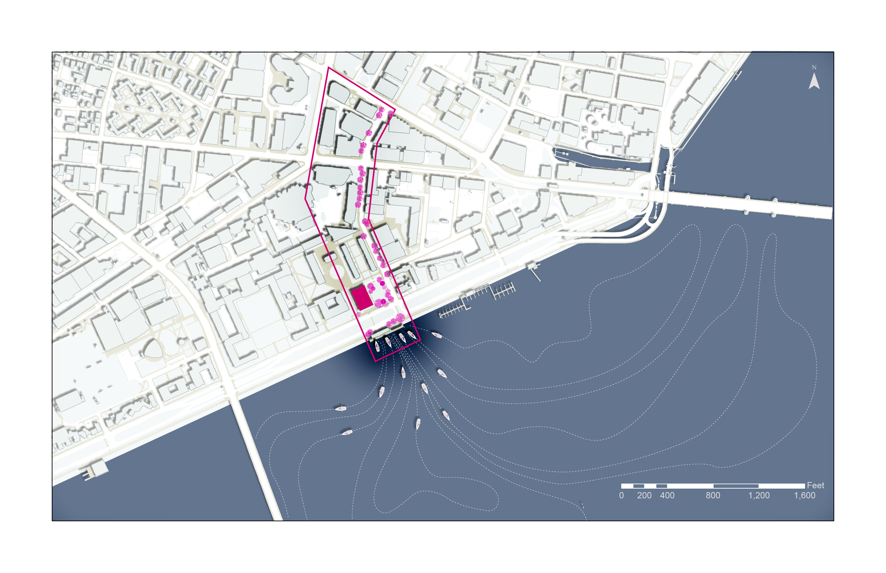
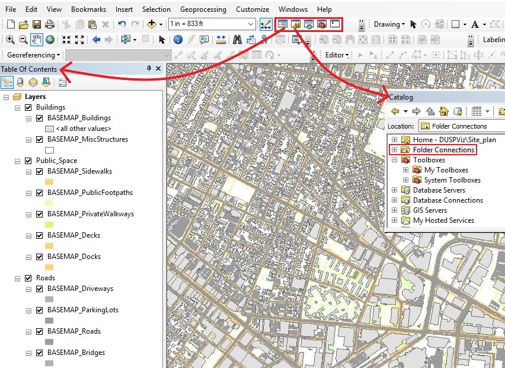

# Site Plan Design
Eric Huntley and Yael Nidam

This tutorial is a one-stop-shop for creating a compelling site plan in illustrator from raw GIS files. The first section will provide best practice advice for exporting layers from GIS to illustrator, and second part will walk through the steps of site plan design in illustrator. We assume no prior knowledge of GIS or Illustrator.

### Lab Data
Download the files from: (Add link)

Alternatively, you can download the following layers directly from the [City of Cambridge GIS page](https://www.cambridgema.gov/GIS/gisdatadictionary/Basemap):

- Buildings
- Sidewalks
- PublicFootpaths
- PrivateWalkways
- Decks
- Docks
- miscStructures
- Driveways
- Parkinglots
- Roads
- Bridges

For people working on MIT machines, please copy the files to your external hard drive. If you don’t have an external hard drive you should get one as soon as possible. In the meantime, you can download the files to your C:\temp directory. Remember that this directory gets erased quite frequently and you should not leave files on c:\temp when you leave lab.

## Part One: From ArcGIS to Illustrator

### 1. Open ArcMap and Add Layers

1. Use ** Catalog ** to connect to the data folder in your computer by right clicking on 'folder connections' and choosing the path to your data folder.
2. Use ** Table of Contents ** to add layers from the data folder by right clicking on the layers icon in the table of Contents and adding all the layers from your data folder.

### 2. Adjust Projection
While the world is round, projections are flat. It is important to choose a projection that's appropriate to your location, otherwise your drawing will look squashed.

In the Table of Content, right-click on the name of the Data Frame (in this case - layers) and choose Properties.
In the pop-up Data Frame Properties window choose the Coordinate Systems tabs. Here choose Projected Coordinate Systems -> State Plane -> NAD 1983 (CORS96) (US FEET) -> NAD_1983_CORS96_StatePlane_Massachusetts_Mnld_FIPS_2001_FtUS. Click OK.

### 3. Define Layout View and Bookmark
Defining a layout view is super important for 2 reasons:
1. If a specific scale is important for your map, you need to set scale and paper size in GIS.
2. If this is a work in progress and you might want to add layers in the future, this will make the process quick and easy.

Follow these steps:
1. Click on the "layout view" icon, it's the second icon to the left, located at the bottom left part of the screen.

2. Define paper size:
File -> Page and Print Setup

For this exercise, please Choose Tabloid (11X17) paper size in landscape orientation. Check the box for 'Use Printer Paper Settings'.

3. Use guides to frame your document by clicking on a ruler. ( if you don't see rulers, add them through View->Rulers). Adjust the map frame according to guides. Use 1 inch margins.

4. Define scale and final view. The scale bar is located at the top. You can use the pan command (hand icon) to move the map within the frame. Add scale to your map and place it outside the map frame. Insert-> Scale Bar.

5. Create Bookmark!
Bookmarks -> Create Bookmarks -> Choose a descriptive name.
This process will help you go back to the same view if you need to export additional layers to the same illustrator file.

6. Add scale and north arrow from the insert tab.

### 5. Export to Illustrator.
Check that all the layers you need are turned on and that you like how you set the view.
File -> Export Map -> Choose location and name, make sure the file type is AI!

## Part Two: Illustrator Editing and Design

### 1. Prepare Layers for Editing
