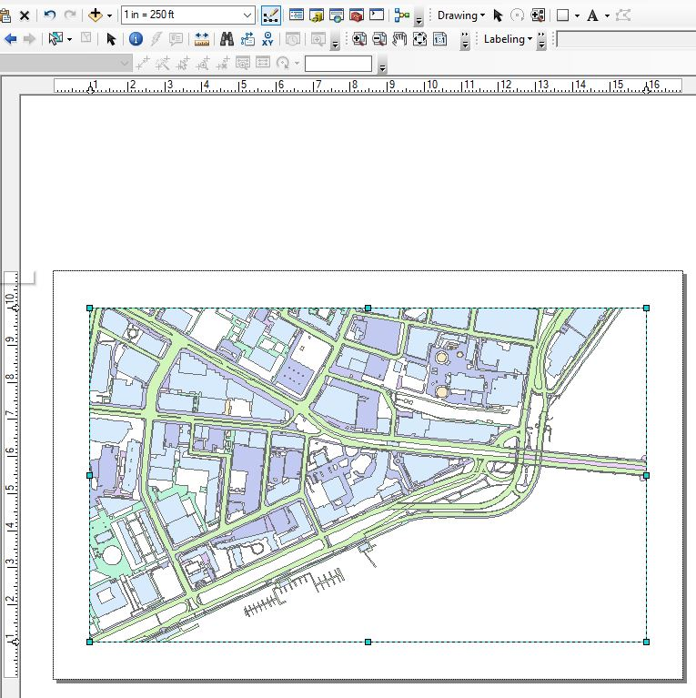

# From GIS to Illustrator

Eric Huntley and Yael Nidam

## Getting Lab Data
Download the files from: (Eric add link)

Please copy the files to your external hard drive. If you don’t have an external hard drive you should get one as soon as possible. In the meantime, you can download the files to your C:\temp directory. Remember that this directory gets erased quite frequently and you should not leave files on c:\temp when you leave lab.

The unzipped file contains ArcGIS and QGIS files and the GIS layers we will be using today.

## Using ArcGIS...

### 1. Open file
open the ArcGIS file named: 'illustrator-workshop.mxd'

###2. Adjust layers
If you open the file and can see the layers, simply skip to the next just.
However, if some or none of the layers are visible and you see a red exclamation mark next to the Layer's name, it means that the connection between the file you're working on and the referenced shapefile is broken. To repair this problem, right-click on one of the files in the TOC, and click “Data” and then select “Repair Data Source…” and navigate to the file which should be in the Data folder.

###3. Adjust Projection
While the world is round, projections are flat. It is important to choose a projection that's appropriate to your location, otherwise your drawing will look squashed.

In the Table of Content, right-click on the name of the Data Frame (in this case - layers) and choose Properties.
In the pop-up Data Frame Properties window choose the Coordinate Systems tabs. Here choose Projected Coordinate Systems -> State Plane -> NAD 1983 (CORS96) (US FEET) -> NAD_1983_CORS96_StatePlane_Massachusetts_Mnld_FIPS_2001_FtUS. Click OK.

###4. Defining layout view and Bookmark
Defining a layout view is super important for 2 reasons:
1. If a specific scale is important for your map, you need to set scale and paper size in GIS.
2. If this is a work in progress and you might want to add layers in the future, this will make the process quick and easy.

Follow the following steps:
1. Click on a small icon at the bottom left of the page that reads "layout view".

2. Define paper size:
File -> Page and Print Setup

For this excercise, please Choose Tabloid (11X17) paper size in landscape orientation. Check the box for 'Use Printer Paper Settings'.

3. Use guides to frame your document by clicking on a ruler. ( if you don't see rulers, add them through View->Rulers). Adjust the map frame according to guides.

4. Define scale and final view. The scale bar is located at the top. You can use the pan command (hand icon) to move the map within the frame. Add scale to your map and place it outside the map frame. Insert-> Scale Bar.

5. Create Bookmark!
Bookmarks -> Create Bookmarks -> Choose a descriptive name.
This process will help you go back to the same view if you need to export additional layers to the same illustrator file.

###6. Export to Illustrator.
Check that all the layers you need are turned on and that you like how you set the view.
File -> Export Map -> Choose location and name, make sure the file type is AI!

## Using QGIS...
