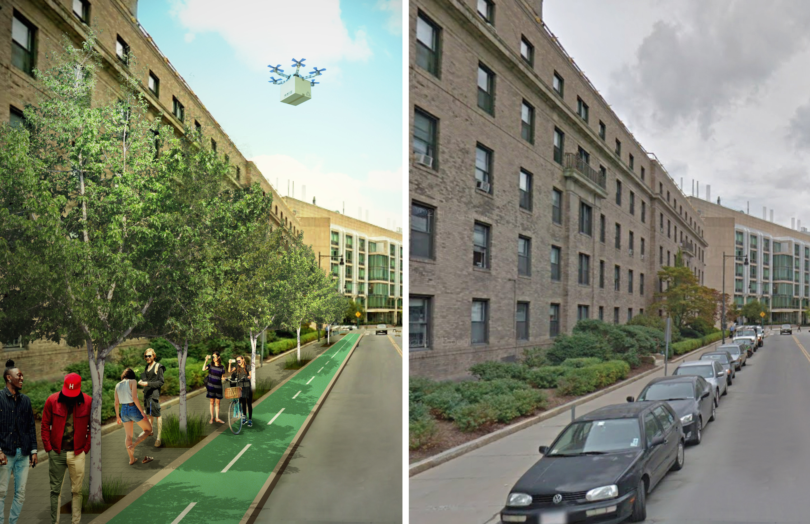
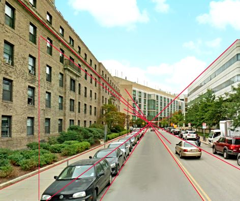
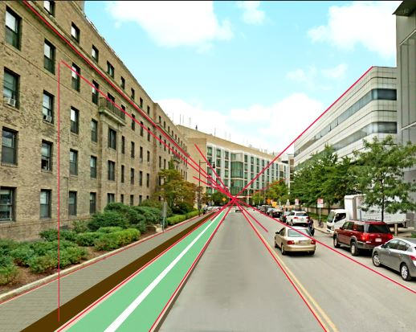
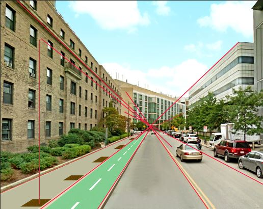
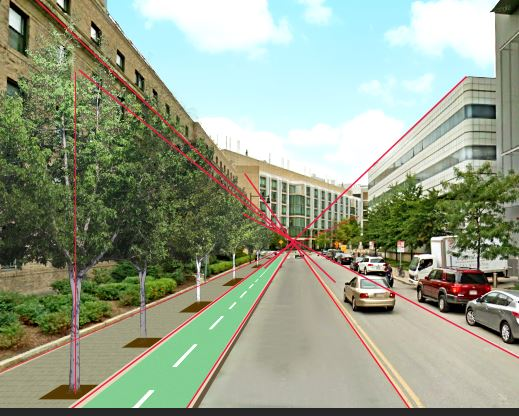
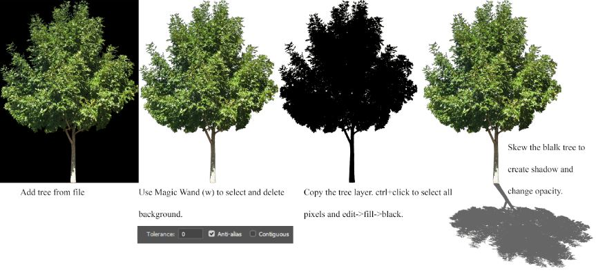

# Quick Street Perspective from Google Street View
[Eric Huntley](@ehuntley) and [Yael Nidam](@yaelnidam)

This tutorial will introduce you to some simple collaging and in photoshop that will help tell a compelling story about your images.

## Files for This Exercise

You can follow this tutorial using any image you like, or [download the images used in this tutorial](http://http://duspviz.mit.edu/resources/adobe/Photoshop_StreetView.zip). The final graphic (very large!) is [available as well](https://www.dropbox.com/s/l0aoz27h5w7yu76/StreetView.zip?dl=0).

## Hotkeys!

We'll be using a number fo tools in this exercise. It can get very tedious clicking on these in the toolbar... as such, you might want to start getting up on your hotkeys. The tools in this exercise are:

- Rectangle Marquee = m
- Lasso = l
- Magic wand = w
- Crop = c
- Clone = s
- Eraser = e
- Gradient = g
- Pen = p
- Line = u

Addionally, every tool you choose will have an associated toolbar where you can set the tool's parameters and properties.

If you want to really commit to learning hot keys, download a 'cheat sheet'! There are many of these... [try this one if you like icons printed on keys](https://cdn.makeawebsitehub.com/wp-content/uploads/2015/04/photoshop-a4-keyboard-shortcuts-print-pdf.pdf).

To start, let's set the move tool bar - uncheck the auto-select. For now we will use the layer menu to select layers we wish to work on. We can still select images manually by pressing the control button and left-clicking above the image we want to select.

## Improve Image Quality

Sometimes the only images available to us are of low quality, that doesn't mean we cannot produce great images! Follow these steps to improve the quality of the image:

### Use Skew to Adjust Perceptive

Images taken from google earth can have twisted perspectives. One way to correct a perspective is to use the skew tool. First make sure the rulers are on (view ->Rulers). Next, press on control and drag a guide line from the edge of the vertical ruler. place the guideline next to a line in the image that should be vertical but isn't, like the window line. Lastly, using the move tool (v), choose the image, check the box to show transform controls at the top bar and press skew to change the location of the vertex so that the perspective will be more similar to normal pictures.

### Use Clone to Remove Street Name

The clone tool paints with pixels from another part of the image. We will use this tool to paint over the street name with road pixels from adjucent area.

- Choose the clone tool (s) and right click to choose a soft edges brush and adjust brush size.
- Alt+click to define the area you wish to clone.
- click on the area you wish to paint over.

### Shadow-highlights

This effects enables editing of the shadows and highlight of the image.
Image ->Adjustments -> Shadow/Highlights

### Sharpen

This filter will make the image appear slightly less pixelated.
There are 2 steps:
1. Filter -> Sharpen -> Unsharp mask Choose Amount>=170 Radius <=2.5
2. Filter -> Sharpen -> Unsharp mask Choose Amount<=50 Radius >=80

### Adjustment layers

At the layer menu, choose the image adjustment icon - it's the half full circle at the middle. From the pop out box, choose these tools:
1. levels - corrects the tonal range and color balance of an image by adjusting intensity levels of image shadows, midtones, and highlights. click on the eyedropper tool to set the absolute black and white of the image respectively.
2. Brightness/Contrast - for this image define brightness=10, contrast=18.
3. Color Balance - for this image define R=1, G=8, B=-12.
4. Create a new group called effects and drag all the adjustment layers inside. To create group - go to the bottom of the layers menu and click on the group icon, third from the right.

## 02 Add Sky

First, create a group called "sky" in the layer menu.

### Use Pen and Mask

Use the pen tool (p) to create the boundaries of the new sky.

- Trace the shape of the Sky
- After you close a shape, go to the layer menu and choose the "sky" group.
- Choose the "add layer mask" icon at the bottom of the layer menu (looks like a camera, third to the left).
- You'll see a linked rectangle next to your group, that is the mask! The mask is a linked layer that literally masks the layer it is linked to. If you choose the mask, you can use black and white colors to edit what is under the mask, when black color is used to mask and white color to expose.

### Use Gradient

- Under the sky group, create a new layer called "Sky Color" and choose this layer.
- select the Gradient (G) in the left panel. Define foreground color= bddbf2 and background color = dae3eb.
- click and drag the mouse from top to bottom to create a gradient.
- Since this layer in under a group with a mask, you only see the area that isn't hidden by the mask. If you want to see the entire layer, you'll have to disable the mask.

### Add Image

Lastly, to add texture to the sky, you can add any image from your own photos or google. Just drag the image into the file and into the sky group and adjust opacity and size.

## Add Bike Lane

Photoshop can make your dreams come true and put a bike lane where a parking space used to be. Just follow these steps:

### Use Line Tool to Create Perspective Lines

- In the layers menu, create a new group called "perspective".
- Choose the line tool (u) and define weight = 0.1cm. Addionally, define fill color as none, stoke as red, and in the path options menu define thickness=0.5px
- Make sure the "perspective" group is chosen in the layer menu.
- Use the line tool to create perspective lines by clicking, dragging and releasing when you want to end the line.

### Use Lasso Tool to Create a New Sidewalk

- Create a new group and name it "ground"
- Under "ground" - Create a new layer and name it "sidewalk"
- Choose "sidewalk" and choose the lasso tool (l). draw the desired sidewalk area between the perspective lines.
- After closing a shape, right click and choose "fill". In the pop up box choose Contents -> color -> Choose sidewalk color. You can also use the eyedropper to sample a color from the drawing.

### Use Lasso Tool to Create sidewalk features

Create a new layer for each unique feature:
- Bike lane.
- Tree planting row.
- Curb.
- Bike deviding line.

Use the same process to create the content for each layer. The final result should look like this:

### Use Mask and Rectangle Marquee to create "dashed" lines.

- Choose the bicycle divider layer and create a layer mask.
- Choose the mask.
- Choose the rectangle Marquee tool (m) and create a rectangle around the area you wish to mask (Part of the line).
- Choose paint bucket tool (g) and color the area in black, this will make this area hidden under the mask.
- Repeat process until you have a dashed line, make sure to obey perspective rules where lines appear long at the front and appear shorter the farther they are from the camera.
- Do the for the tree planting layer.

### Add sidewalk texture

- Choose a texture from the internet or the provided folder and drag to the "ground" layer.
- Use the skew tool to place in perspective.
- use the mask tool to clip to the desired dimensions.

## Add Trees

1. Download trees or use trees from the provided file into a new group named "trees".
2. After adjusting to the largest needed tree scale, click on the tree layer and rasterize layer.
2. Use magic wand tool (w) to delete black background. Make sure to define tolerance=0 and check the box for continues in the top bar.
3. Plant them in the predefined planters and make sure that their height obeys perspective rules (use your perspective lines!).

### Some fun tricks to make you trees look different from each other:
1. Choose the second tree and use the move tool to see its transform controls. Click on one of these controls and a new bar will appear at the top. To create a mirror image of that tree add a minus sigh before the values under the horizontal scale (W).
2. Choose Another tree and slightly change its colors. Image ->Adjustments->hue/Saturation.
3. Use the Burn/Dodge tool to add depth, by making areas exposed to the sun lighter and vise versa.

### Create tree shadow

1. Create a new group names "Tree Shade" and place under trees. Set opacity to 40%.
2. Duplicate one of the trees in one of two ways:
- Drag it to the new layer icon at the bottom of the layer menu.
- Choose the Tree you want to copy, press alt+left click and drag.
3. Place the copied tree in the tree shade group and name it "Tshade"
4. In the layer menu, press control and click on the Tshade rectangle. This action will select all pixels in the layer.
5. In the top bar go to Edit-> fill -> Black.
6. Skew the Tree silhouette to create shadow that's appropriate to the sun direction and intensity in your image.
7. Duplicate and scale the silhouette to add shadow to the rest of the trees.

## Use Brush effects to add Vegetation

1. Create a new group named "Vegi".
2. In this group, create a new layer named "grass".
3. Choose the brush tool (b) and choose a grass brush. If none is available install any grass brush from google or from the provided folder.
4. Define foreground and background colors: one should be light green and another dark green.
5. Start "planting" grass alternating between light and dark green, it's also helpful to set brush opacity to ~75%. Make sure to adjust scale as you go. as a short cut, the square parentheses will increase or decrease the brush size.
6. If necessary, use mask to hide areas where grass isn't needed.

## Add people and objects

1. Create a new group named "people"
2. Download images from google or use the provided image.
3. Place people in the image and scale appropriately.
4. Add shadow the same way you added shadow to trees.

## Color Effects

This trick adds vitality to the image and focuses the viewer's attention on the story you want to tell.

1. Create a new layer and name it "effects2", set opacity to 50%.
2. Create 2 new layers and name them: "light" and "dark".
3. Choose light and use the gradient tool (g) to fill it with a warm yellow/bright orange color.
4. In the layer menu change "normal" to "multiply".
5. Create a layer mask by clicking on the layer mask icon at the bottom of the layers menu.
6. Choose the mask and use the gradient tool to color it all black. This step will hide the entire layer.
7. Stay on the mask and use the soft edge brush tool with white color to highlight the areas you want to emphasize.
8. Now Choose the "dark" layer and use the gradient tool to color it dark green (nearly black), and repeat steps 4-6.
9. Choose the "dark" mask and use the gradient tool (g), radial option, to create an "Instagram effect" where the edges/less important information is darker and the focus area is lighter.

## Light Effects

When the image is final and you want to add one final touch, add a final light effect.

1. Create a new group named "perspective" and place all the layers you've worked on so far in this group.
2. duplicate group by dragging it to the "new layer" icon at the bottom of the layer menu.
3. right click on the duplicate layer and merge layers, name the new layer "light effect".
4. In the top tab: Filter -> Render -> Lighting Effect. Choose the effect you want.
5. Play with this layer's opacity to see what's the best fit for the render.
