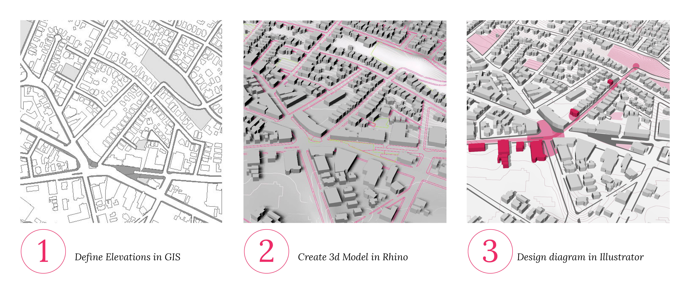

# 3D model - 1/3 GIS to Rhino
[Eric Huntley](@ehuntley) and [Yael Nidam](@yaelnidam)

This set of three tutorials will utilize GIS data to create a 3D model in rhino and final graphic editing in Illustrator.

### File for This Exercise
[Download the GIS file for this exercise here.](http://web.mit.edu/ehuntley/Public/rhino_workshop.zip)

## ArcMap Setup
Open ArcMap and upload the following layers:
1. contours_clip
2. Somerville_bldg
3. Somerville_sidewalk
4. Somerville_openSpace
5. Study_area_05

** The contour layer was derived from a Digital Elevation Model (DEM), which produces clean and continues contour lines. This method is preferred to the overly detailed contour lines available through municipalities' websites, that are usually not continues or closed polygons.

## Generate topography polygons

### 1. Create line feature from the study area box.
Data Management Tools -> Features -> Feature to Line

Input Features: Study_area_05
Output Feature Class: ~/Box_Line

### 2. Merge box line with contours
Select Contours.
Data Management Tools -> General -> Append

Input Datasets: Box_Line
Target Dataset: contours_clip
Schema Type: NO_TEST (IMPORTANT!!!!)

### 3 .Convert merged box/contours into a polygon layer.
Data Management Tools -> Features -> Feature to Polygon

Input Features: Contours
Output Feature Class: ~/ContoursPolygon

### 4 . Spatially join polygons with contours to obtain elevations
- Right-click ContoursPolygon layer in Table of Contents.
- Joins and Relates -> Join

What do you want to join to this layer?
Join data from another layer based on spatial location.

- Select Contours as the layer to be joined.
- Select "Each polygon will be given a summary..."
- Check the "Maximum" box.

Output: ~/ContoursPolygon_Elev

Congrats! you've successfully created topography polygons.

### 5. Add elevation field to ContoursPolygon_Elev attribute table
This step creates a new field called Elevation in the attribute table and populates it with the values recieved from the max function earlier. This step is needed for 2 reasons: 1. Clarity. 2. Rhino needs this field to read the polygons' elevation.

- Right-click ContoursPolygon_Elev layer in table of Content
- Open attribute table -> Add Field -> Field name: Elevation
- Right-click on Elevation field -> Field Calculator
- Elevation = [Max_Contou]

## Based on topography, Add elevations to building footprints

### 1. Join the building footprints with the elevation data
- Right-click Building Footprints layer in Table of Contents.
- Joins and Relates -> Join

What do you want to join to this layer?
Join data from another layer based on spatial location.

- Select ContoursPolygon_Elev as the layer to be joined.
- Select "Each polygon will be given a summary..."
- Check the "Minimum" box.

Output: ~/BuildingFootprints_Contours

### 2. Add elevation to building height.
Open the attribute table for BuildingFootprints_Contours

- Create new field called "Elevation"
- Right click the field name and open the field calculator.
- Elevation = 30 + [Min_Elevat]

### 3. Check to make sure all fields you will be exporting to DWG files include an elevation field.

## Export to DWG for AutoCAD or Rhino
### 1. Select layers to export
In Table of Contents Layers window, right click the ContoursPolygon_Elev layer: Data -> Export to CAD

### 2. Export settings
Input feature: select BuildingFootprints_Contours to add it for CAD export. Create a new folder to save this file as an output from GIS. 

- IMPORTANT NOTE: All layers should have identical Projected Coordinate System (in this tutorial: NAD_1983_StatePlane_Massachusetts_Mainland_FIPS_2001_Feet) when exporting a single DWG file with multiple layers. If there are mixed coordinate systems, you may find layers do not place in the same place when importing the DWG into Rhino.

## Import DWG in Rhino
### 1. Launch Rhino
Open Rhino and create a new file (Large Object: Feet). The linear unit should be the same with your GIS file's projected coordinate system. We will introduce more about the interface, views, commend, and layer management in Rhino.

### 2. Loading DWG into Rhino
Insert the DWG file into Rhino. We will discuss the difference between Insert and Import.

### 3. View and layer management
- View management: Type "Zoom" in commend window -> Extend, to zoom to the DWG file. 

- Layer management: In Layer Panel, you will see the identical layers in Rhino as ArcGIS. You can manage the layers by 1) assign the current layer; 2) turn on/off the layer; 3) rename; and 4) restyle the layer with different colors and line weight.

#### Congratulations! Now you've successfully exported GIS data as a DWG file (drawing file) and imported in Rhino for 3D creation. Move forward to the next session on generating topography, extrusion, and render in Rhino.

